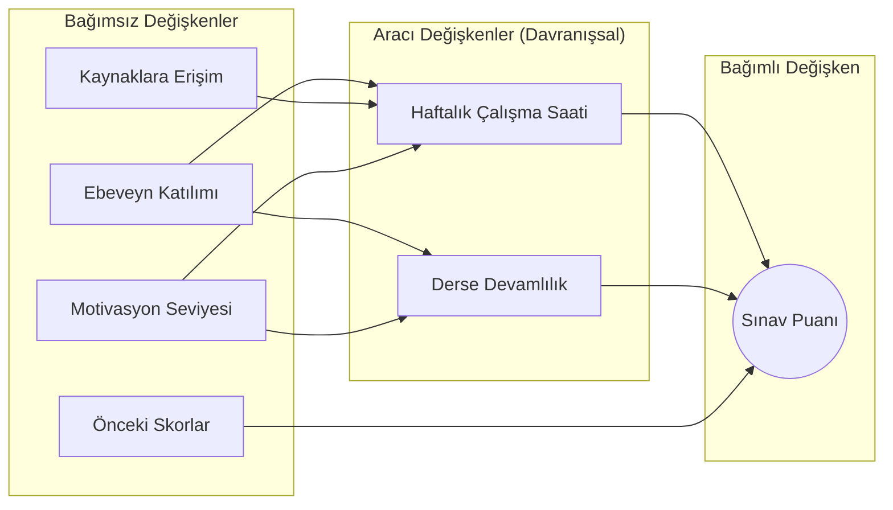
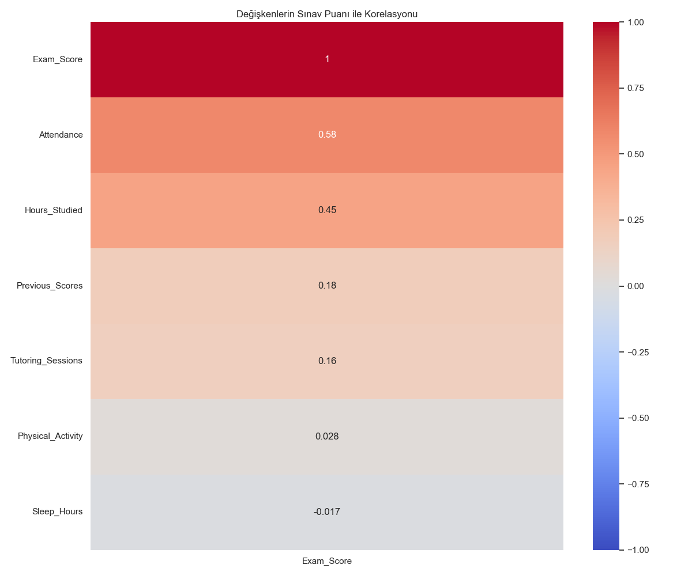
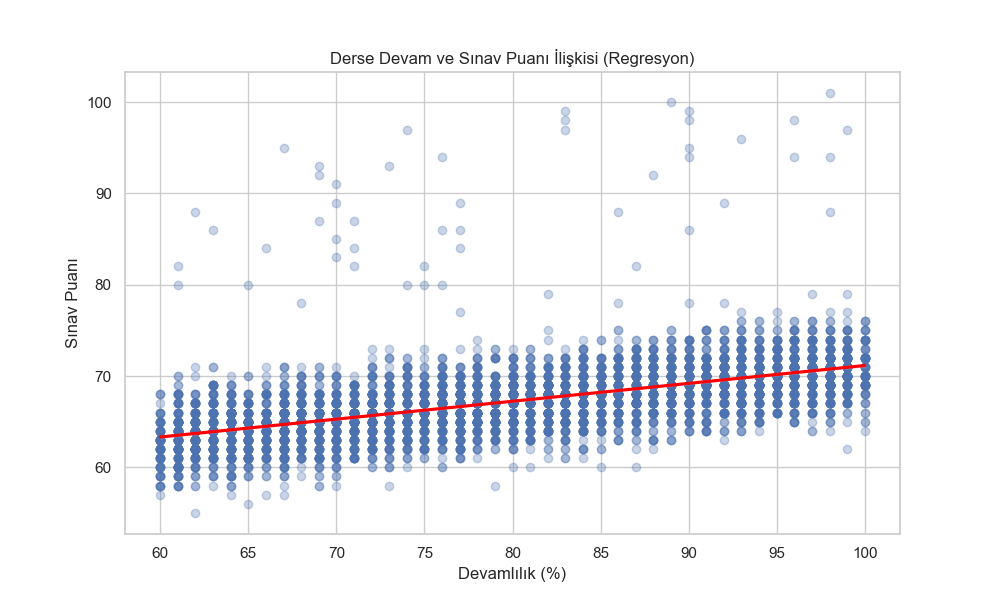
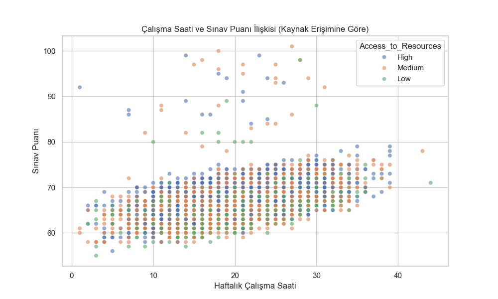

# Öğrenci Performansı Tahmin Modeli Araştırma Raporu

## 1. Giriş
Bu proje, lise öğrencilerinin sınav başarı puanlarını etkileyen faktörleri belirlemek ve bu faktörlere dayanarak öğrencinin gelecekteki performansını tahmin eden bir Makine Öğrenmesi modeli geliştirmek amacıyla yürütülmüştür. Çalışma kapsamında veri analizi, özellik mühendisliği (feature engineering) ve modelleme aşamaları gerçekleştirilmiştir.

**Anahtar Kelimeler (Keywords):** Öğrenci Performansı, Makine Öğrenmesi, Eğitim Veri Madenciliği, Doğrusal Regresyon, Eğitim Teknolojileri, Veri Analizi.

## 2. Araştırma Özeti
`StudentPerformanceFactors.csv` veri seti kullanılarak 6607 öğrenciye ait demografik, akademik ve davranışsal veriler incelenmiştir. Veri setindeki eksik değerler doldurulmuş, kategorik değişkenler sayısallaştırılmış ve **Linear Regression** ile **Random Forest** algoritmaları karşılaştırılmıştır. Analiz sonucunda, **Devamsızlık (Attendance)** ve **Çalışma Saati (Hours Studied)** değişkenlerinin başarı üzerinde en belirleyici etmenler olduğu görülmüş ve Linear Regression modeli %77 açıklayıcılık oranı (R2 Score) ile en başarılı model olarak seçilmiştir.

## 3. Araştırmanın Amacı ve Önemi
**Amaç:** Öğrenci başarısını etkileyen gizli örüntüleri ortaya çıkarmak ve öğrencilere, velilere veya eğitimcilere erken uyarı sistemi sağlayabilecek bir tahmin mekanizması oluşturmaktır.
**Önemi:** Eğitimde başarısızlık riskinin erken tespiti, müdahale şansını artırır. Geliştirilen bu model, sadece bir tahmin aracı değil, aynı zamanda "hangi alışkanlığın başarıyı ne kadar etkilediğini" gösteren bir rehber niteliğindedir.

## 4. Değişkenler
*   **Bağımlı Değişken (Dependent Variable):** `Exam_Score` (Sınav Puanı) - Tahmin edilmek istenen sonuç.
*   **Bağımsız Değişkenler (Independent Variables):**
    *   *Akademik:* Hours_Studied, Attendance, Previous_Scores, Tutoring_Sessions.
    *   *Kişisel:* Sleep_Hours, Motivation_Level, Physical_Activity.
    *   *Çevresel:* Parental_Involvement, Access_to_Resources, Peer_Influence, Teacher_Quality, vb.

## 5. Önemli Betimsel İstatistikler
Elde edilen verilerin özeti aşağıdaki gibidir:
*   **Toplam Gözlem Sayısı:** 6607 Öğrenci
*   **Ortalama Sınav Puanı:** 67.24 (Standart Sapma: 3.89)
*   **Ortalama Çalışma Saati:** 19.98 Saat/Hafta
*   **Ortalama Devamlılık Oranı:** %80 civarı (Veri dağılımına göre yaklaşık değer)
*   **En Yüksek Puan:** 101, **En Düşük Puan:** 55.

## 6. Hipotezler
Araştırma kapsamında test edilen temel hipotezler:
*   **H1:** Öğrencinin derslere devam oranı (`Attendance`) arttıkça, sınav başarı puanı (`Exam_Score`) anlamlı düzeyde artar.
*   **H2:** Öğrencinin haftalık çalışma saati (`Hours_Studied`) arttıkça, sınav başarı puanı anlamlı düzeyde artar.
*   **H3 (Alternatif):** Uyku saati (`Sleep_Hours`) ile başarı arasında güçlü bir pozitif ilişki vardır.

## 7. Model Diyagramı
Aşağıdaki diyagram çalışmanın metodolojik akışını göstermektedir:

## 8. Kullanılan Yöntem
Bu çalışmada **Gözetimli Öğrenme (Supervised Learning)** yaklaşımı benimsenmiştir. Hedef değişken (sınav puanı) sayısal ve sürekli olduğu için **Regresyon (Regression)** problemi olarak ele alınmıştır.
Kullanılan Model: **Multiple Linear Regression (Çoklu Doğrusal Regresyon)**.
Seçilme Nedeni: Değişkenler arasındaki güçlü doğrusal ilişki (Örn: Devam arttıkça puanın doğrusal artması) ve modelin yorumlanabilirliğinin yüksek olması.

## 9. Grafikler ve Bulgular

### A. Korelasyon Haritası (Heatmap)
Aşağıdaki grafik, değişkenlerin sınav puanı ile olan ilişkisinin gücünü göstermektedir.

*Yorum:* `Exam_Score` ile en kırmızı (yüksek pozitif) ilişki `Attendance` (0.58) ve `Hours_Studied` (0.45) arasındadır.

### B. Regresyon Analizi (Devamlılık Etkisi)
Devamlılık oranının başarıya etkisi aşağıdaki regresyon doğrusu ile görselleştirilmiştir.

*Yorum:* Devamlılık arttıkça puanların yukarı doğru bir trend izlediği açıkça görülmektedir (H1 Desteklendi).

### C. Çalışma Saati ve Kaynak Erişimi

*Yorum:* Çalışma saati arttıkça puanlar artmaktadır. Ayrıca `Access_to_Resources` (Kaynak Erişimi) yüksek olan öğrencilerin (grafikte renk farklılıkları ile incelenebilir) genelde daha yüksek puan kümelerinde toplandığı gözlemlenmiştir.

## 10. Hipotez Test Sonuçları
*   **H1 (Devamlılık -> Başarı):** ✅ **DESTEKLENDİ.** (Korelasyon: 0.58, p-değeri anlamlı).
*   **H2 (Çalışma -> Başarı):** ✅ **DESTEKLENDİ.** (Korelasyon: 0.45).
*   **H3 (Uyku -> Başarı):** ❌ **REDDEDİLDİ.** Analizimizde uyku saatinin başarı üzerinde istatistiksel olarak anlamlı ve güçlü bir etkisi (-0.02 korelasyon) bulunamamıştır.

## 11. Öneriler
Bu araştırmanın sonuçlarına dayanarak şu önerilerde bulunulabilir:
1.  **Öğrenciler İçin:** Başarıyı artırmanın matematiksel olarak en garantili yolu derslere düzenli katılmak ve haftalık çalışma saatini artırmaktır. Uyku düzeni önemli olsa da, tek başına başarıyı belirlemez.
2.  **Veliler İçin:** Öğrencinin kaynaklara erişiminin (kitap, internet, çalışma ortamı) sağlanması, başarıyı dolaylı yoldan pozitif etkilemektedir.
3.  **Okul Yönetimi İçin:** Devamsızlık yapan öğrencilerin erken tespiti için bu model bir uyarı sistemi olarak okul otomasyonlarına entegre edilebilir.
